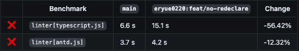

# Weekly 37

不上班两个月了，越久不工作就会越来越不想工作。最近已经在开始调整状态，同时也在整理简历，从上周投完之后自己觉得还是应该要听从建议。简历写的太简单了就不太容易获得面试机会。而且面试官也无从聊起。twitter 真是个宝藏地方，这次也听从了推友建议，可以搜搜 `figma resume` ，会有很多好用的模板。再多说一句，figma 是真的好用，上手成本跟 sketch 高出不知道哪里去。sketch 用起来总会让人心生敬畏。游泳这周总算是有些进步了，从之前的开始洗澡，到现在已经能开始慢慢地游起来，就是腿好疼。

这周给自己报了 12.01 的雅思考试， 从今天起到 11.30 一共还剩下 81 天。接下来的时间里，需要突击下口语和写作。口语一直都是自己的一个老大难的问题，虽然知道怎么写，但是要转换成英语表达又经常地要闹笑话。而之所以会这么冲动，主要是想倒逼自己一把，让自己能够在英语上快速发力。而不是一直在跟自己磨洋工。目标是 5.5，希望能够有 6.5 的突破。

说回工作。这周最开心的是，其实有两件。第一个是，在经过和 `oxc` 搏斗的一个月。我终于是把 `no-redeclare` 这个规则给实现了。但也没有完全实现，因为实现的逻辑经过 benchmark 测试要比原先慢 56%，先放一放吧，下周再继续（脑袋好疼。

其次是一个多月前提交的 orogene 的 [PR](https://github.com/orogene/orogene/pull/282) 总算是被 merge 了，这还是第一个在毫无任何 request changed 的情况下直接被 merge。已经一个多月没有看过相关的更新进展，以为这个项目都要被放弃了，之前还信誓旦旦地要在这里发发力。不过接下来也可以继续提 PR 来让 orogene 能快一点到 1.0 的版本吧。
